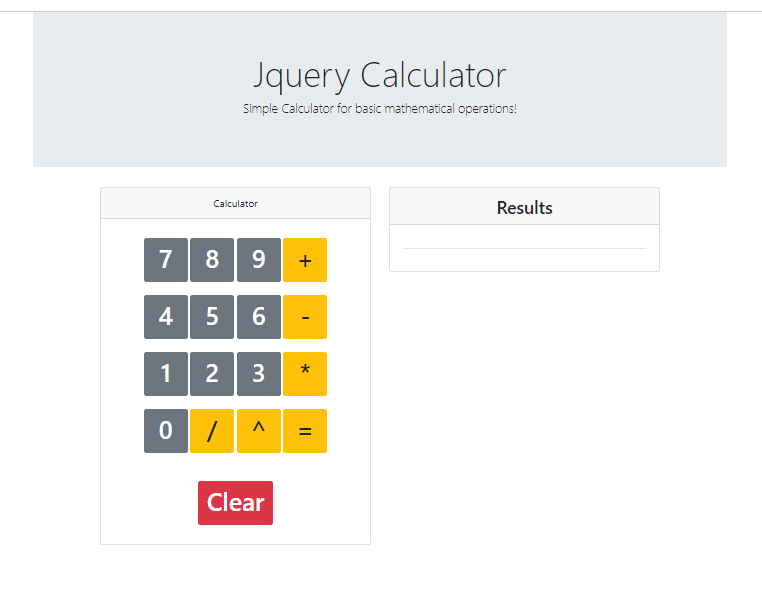

# Javascript Calculator

## Overview

Your task is to recreate the design and functionality of a web calculator.

This lab **not** a deliverable

## Setup

Attempt to do the lab in this repo, but if you prefer to use repl.it, you can copy over the images from here.

1. Inside the `student` folder, create an `index.html` file. 
2. Inside the `student` folder, create a `style.css` file. 
3.  Inside the `student` folder, create an `app.js` file. 
4. Add the boilerplate to your html file. 
5. Connect your CSS file to your HTML file and make sure that it is attached (hint: give the body a background color temporarily) 
7. Add a `console.log` to your app.js
8. Inside the `student` folder, create an `readme.md` file. 

## Requirements:
- wireframe image (nothing fancy) should be a file in the student folder.
    - *see wireframing resources on how to use it for building a layout with HTML and CSS.*
- should follow the layout including button orientation and order.

## Behaviour
- should be able to perform simple arithmatic ( no bedmas )
- should be able show a result when `=` is pressed
- should be able to clear the result if clear is pressed
- should clear previous result when a user starts again
- should be clear of any test only code `console.logs` etc

## Bonus:
- make the calculator mobile friendly (responsive design)
- implement layout change for both large and small screens transition (change in width)

## Wireframing Resources
1. [Guide to Wireframes](https://webdesign.tutsplus.com/articles/a-beginners-guide-to-wireframing--webdesign-7399)
3. [Example image of wireframing the supply mockup by hand](https://imgur.com/N611F5d.png)

## Flexbox Resources:
[A Complete Guide to Flexbox (CSS Tricks](https://css-tricks.com/snippets/css/a-guide-to-flexbox/))  
[Equidistance Spacing- examples of failed attempts and wins](https://css-tricks.com/equidistant-objects-with-css/)
